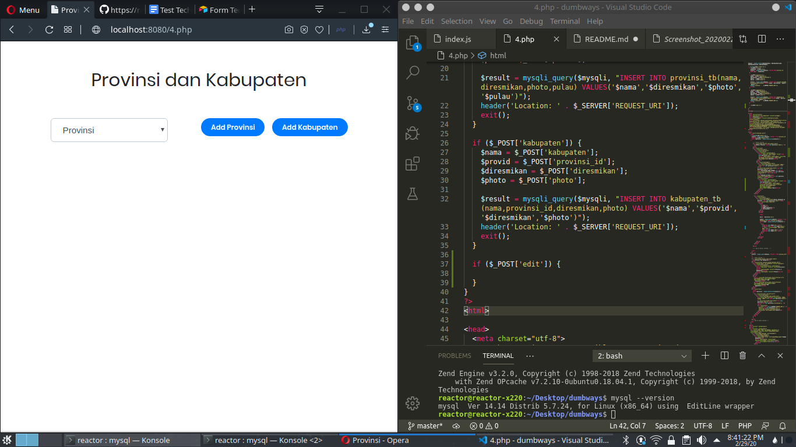
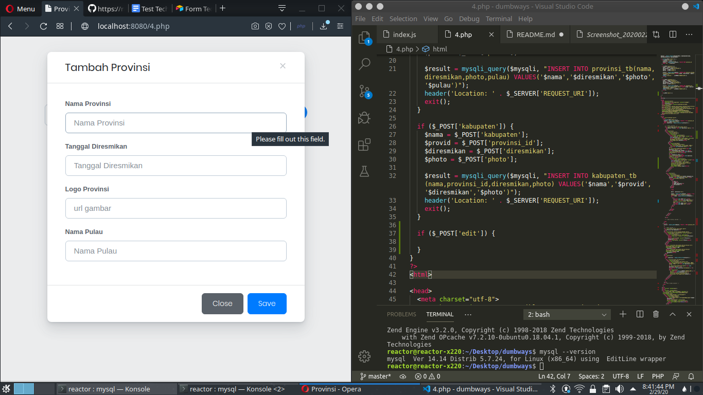
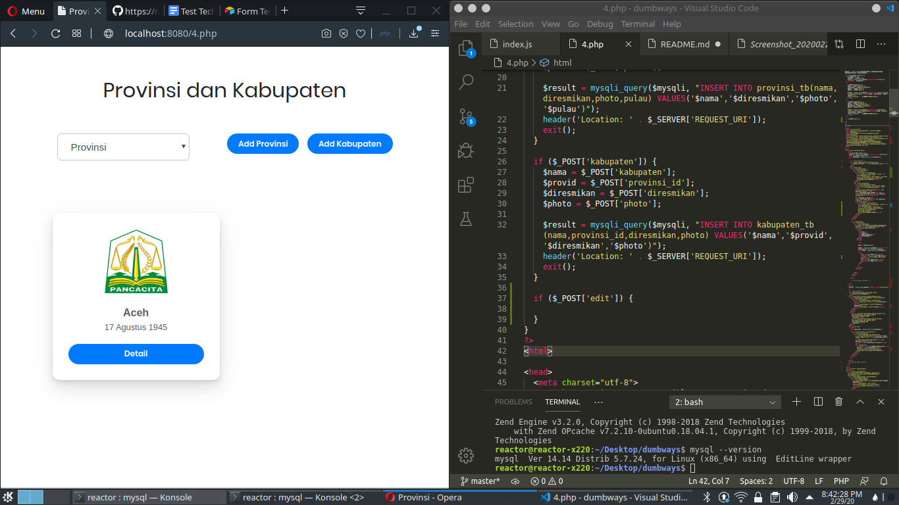
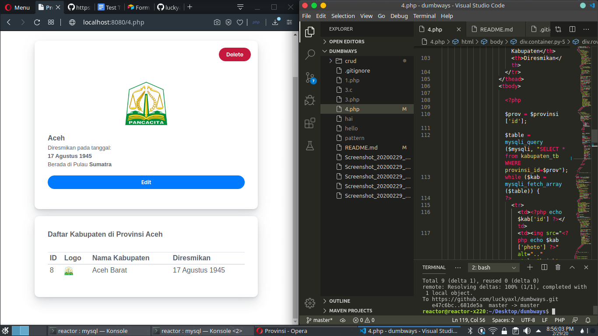

# Test Technical Bootcamp DumbWays Batch 15 Kloter 2

## Nomer 4. CRUD

#### Package

- **Language:** PHP 7.2.10
- **css**: Bootstrap
- **javascript**: jQuery
- **Database** MySQL 14.14 Distrib 5.7.24
- **Editor:** [Visual Studio Code](https://code.visualstudio.com/)
- **OS**: Ubuntu 18.04 LTS KDE

#### Referensi  
- [codepolitan](https://www.codepolitan.com/tutorial-membuat-crud-php-dengan-mysql-59897c72d8470)
- [stackoverflow 1](https://stackoverflow.com/questions/6320113/how-to-prevent-form-resubmission-when-page-is-refreshed-f5-ctrlr)
- [stackoverflow 2](https://stackoverflow.com/questions/14595810/use-post-to-get-input-values-on-the-same-page)
- [stackoverflow 3](https://stackoverflow.com/questions/7639269/using-html-form-within-php-isset-function)
- [w3school](https://www.w3schools.com/php/php_mysql_connect.asp)

#### Step

#### Buat Database dan table

```bash
mysql> create database testcrud;
```

#### Membuat table provinsi_tb

```bash
mysql> create table provinsi_tb(
    -> id int NOT NULL AUTO_INCREMENT,
    -> nama varchar (50) NOT NULL,
    -> diresmikan varchar (50) NOT NULL,
    -> photo varchar (10000) NOT NULL,
    -> pulau varchar (100) NOT NULL,
    -> PRIMARY KEY (id)
    -> );
```

#### Membuat table kabupaten_tb

```bash
mysql> create table kabupaten_tb(
    -> id int NOT NULL AUTO_INCREMENT,
    -> nama varchar (100) NOT NULL,
    -> provinsi_id int (100) NOT NULL,
    -> diresmikan varchar (100) NOT NULL,
    -> photo varchar (1000) NOT NULL,
    -> PRIMARY KEY (id)
    -> );
```

#### Screenshot


#### Menjalankan server localhost

```bash
php -S localhost:8080

```

#### Menjalankan Program










